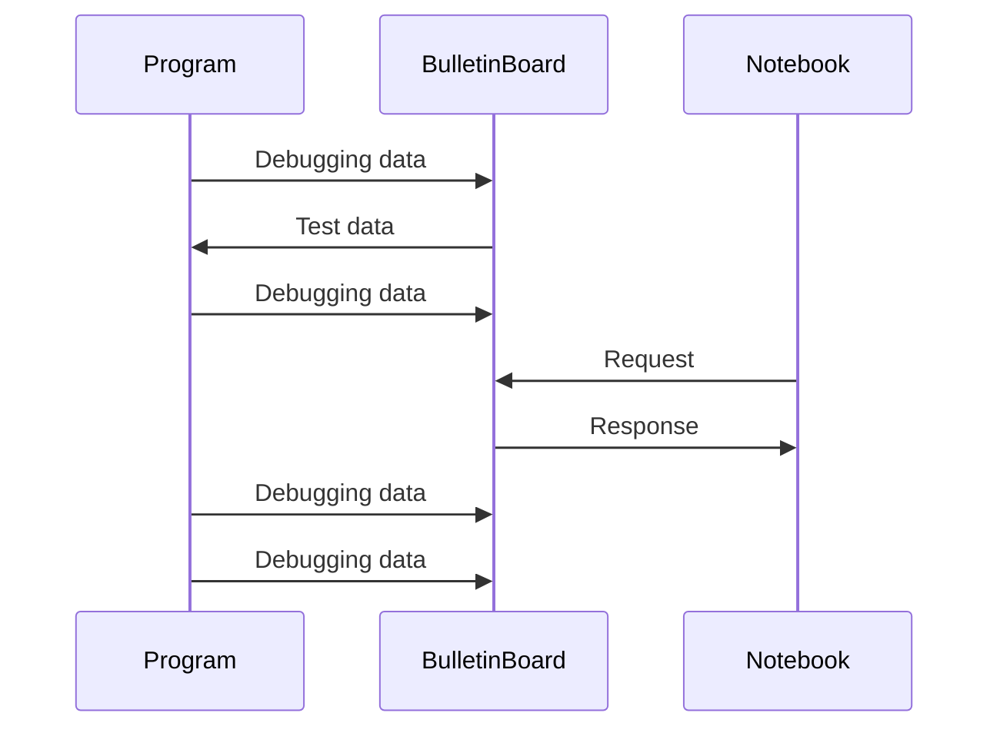

dbgbb
===========================

[](https://www.buymeacoffee.com/YShojiHEP)
[](https://github.com/sponsors/YShoji-HEP)
[](https://crates.io/crates/dbgbb)
[](https://crates.io/crates/dbgbb)
[](https://github.com/YShoji-HEP/dbgbb/blob/main/LICENSE.txt)

**dbgbb** is a robust framework designed for analyzing debugging data within Mathematica and Jupyter notebook environments.

Related projects: [`ArrayObject`](https://github.com/YShoji-HEP/ArrayObject), [`BulletinBoard`](https://github.com/YShoji-HEP/BulletinBoard).

## Features

- Seamless integration with [`BulletinBoard`](https://github.com/YShoji-HEP/BulletinBoard) for reading test data and sending debug data using concise macros.
- Automatic inclusion of file name, line number, and column number in debug tags.
- Buffered sender option minimizes TCP transactions, preserving runtime performance.
- Comprehensive data collection tools: accumulation, one-shot, and frequency reduction.
- Real-time and persistent access to debug data during and after program execution.
- In-memory server storage enables ultra-fast random access to debugging data.
- Supports unsigned/signed integers, floating-point real and complex numbers, strings, and arrays (`Vec<_>`, `[T;N]`, `ndarray`, `nalgebra`).
- High-speed communication via Unix sockets on compatible operating systems.



## Important Notes

- Data transmission is not encrypted. Do not send confidential information over the network.
- This crate is under active development; specifications may change. Compatibility between `BulletinBoard` and `dbgbb` is maintained for matching minor version numbers.
- Running tests will access the server and may overwrite existing data.

## Getting Started

Before using `dbgbb`, set up a [`BulletinBoard`](https://github.com/YShoji-HEP/BulletinBoard) server and configure the server address via an environment variable. For convenience, add the following to your Rust project's `.cargo/config.toml`:

```toml
[env]
BB_ADDR = "ADDRESS:PORT"
```

### Rust Example

```rust
use dbgbb::dbgbb;

fn main() {
    let test = vec![1f64, 2., 3.];
    dbgbb!(test);
}
```

Debug data can be visualized in Mathematica or Jupyter notebooks. Refer to [`BulletinBoard`](https://github.com/YShoji-HEP/BulletinBoard) for visualization details.

## Roadmap

- [x] Support for `Vec<Vec<T>>` and `Array1<Array1<T>>`
- [ ] Support for additional array types
- [ ] Support for other languages

## Q&A

### Why not use CSV files?

CSV is impractical for arrays with more than two dimensions and results in larger file sizes due to text storage. Frequent writes also degrade performance. `dbgbb` uses buffered transmission for efficient, non-blocking data collection.

### Why not use HDF5 files?

HDF5 files can be problematic when accessed during writes and require complex setup. `dbgbb` offers a simpler syntax and in-memory storage for fast access, with the ability to read data during program execution.

### Why not use a plotting library?

Plotting libraries often require rerunning code to regenerate data, which is inefficient for scientific workflows. `dbgbb` preserves all data versions, facilitating quantitative analysis and cross-language comparisons.

### Why not use the `dbg!(...)` macro?

While `dbg!(...)` is suitable for small data, it becomes unwieldy for large or multi-dimensional arrays. `dbgbb!(...)` provides immediate visualization in notebooks and maintains all revisions on the server for easy comparison.

### How does `dbgbb` differ from `bulletin-board-client`?

`bulletin-board-client` is designed for full server manipulation and has more dependencies. `dbgbb` is lightweight, focused on debugging, and includes specialized data collection tools.
