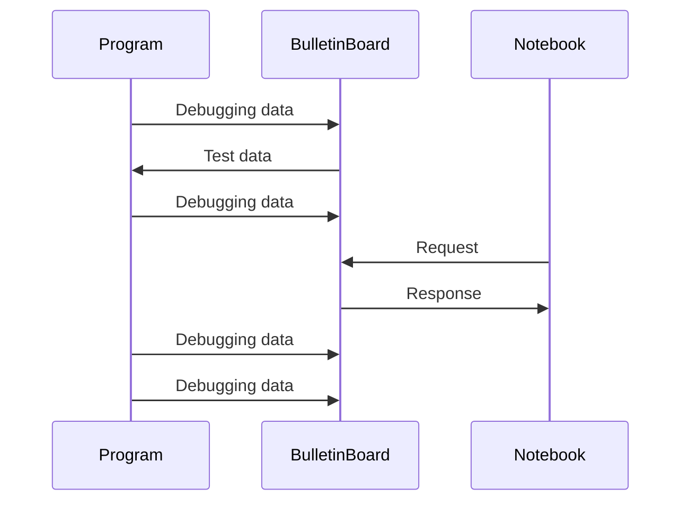

dbgbb
===========================
[](https://github.com/sponsors/YShoji-HEP)
[](https://crates.io/crates/dbgbb)
[](https://crates.io/crates/dbgbb)
[](https://github.com/YShoji-HEP/dbgbb/blob/main/LICENSE.txt)

A framework for analyzing debugging data in a notebook.

See also [`ArrayObject`](https://github.com/YShoji-HEP/ArrayObject) and [`BulletinBoard`](https://github.com/YShoji-HEP/BulletinBoard).

Highlights
----------
* Read test data from `BulletinBoard` and send debug data to `BulletinBoard` with simple macros.
* The file name, the line number and the column number are automatically retrieved and included in the tag.
* Optional buffered sender reduces TCP transactions and maintains the program runtime speed.
* Various tools for data collection: accumuation, oneshot and frequency reduction.
* Debug data can be read during program execution and persist after execution.
* Unsigned/signed integer, real float, complex float and string are supported. For array data, `Vec`, `ndarray` and `nalgebra` are currently supported.



Example
-------
Before using `dbgbb`, you must set up a [`BulletinBoard`](https://github.com/YShoji-HEP/BulletinBoard) server and set the server address in the environmental variable. It is convenient to set it in `.cargo/config.toml` of your Rust project:
```rust
[env]
BB_ADDR = "ADDRESS:PORT"
```

Rust example:
```rust
use dbgbb::dbgbb;

fn main() {
    let test = vec![1f64, 2., 3.];
    dbgbb!(test);
}
```

The debug data can be visualized, for example, in a Mathematica Notebook. See [`ArrayObject`](https://github.com/YShoji-HEP/ArrayObject) for details.


ToDo
----
- [ ] Jupyter notebook support (Python, Julia).
- [ ] Windows support. 
- [ ] Support for other arrays.
- [ ] Support for `Vec<Vec<T>>` and `Array1<Array1<T>>`.

Q&A
--------------
#### Why not use the `dbg!(...)` macro?
For a small number of variables, it is, in fact, efficient to print them using `dbg!(...)`. However, for a large number of variables like a higher-dimensional array, the output becomes cluttered and difficult to read. Together with a notebook, `dbgbb!(...)` offers an immediate visualization of variables with a similar syntax. In addition, `dbgbb` keeps all revisions in the server, so you can easily compare different versions of code.

#### Why not use a CSV file?
For arrays with more than two dimensions, CSV files are clearly not an option. In addition, for large data, the data size becomes huge compared with `dbgbb` because CSV stores values as text. Also, frequent data storage slows down the runtime speed of the program. The buffered sender of `dbgbb` allows data to be collected in an almost non-blocking manner.

#### Why not use a HDF5 file?
It is sometimes useful to be able to read debugging data while the program is running. HDF5 easily collapses if the file is opened while it is being written. In addition, the syntax of `dbgbb` is much simpler than HDF5, which requires setting the database name, array shape, etc.

#### Why not use an integrated visualizer?
When the plot is not satisfactory, the entire code must be rerun since all data is gone once the program terminates. This is often a pain in scientific computations. It is thus more sensible to separete the plotting code from the main code.
It is also important to keep the initial erroneus data because otherwise it becomes difficult to quantitatively check improvements. `dbgbb` keeps all versions, which can be read anytime.
In addition, it also makes it easier to compare with the results obtained in a different language such as Mathematica.

