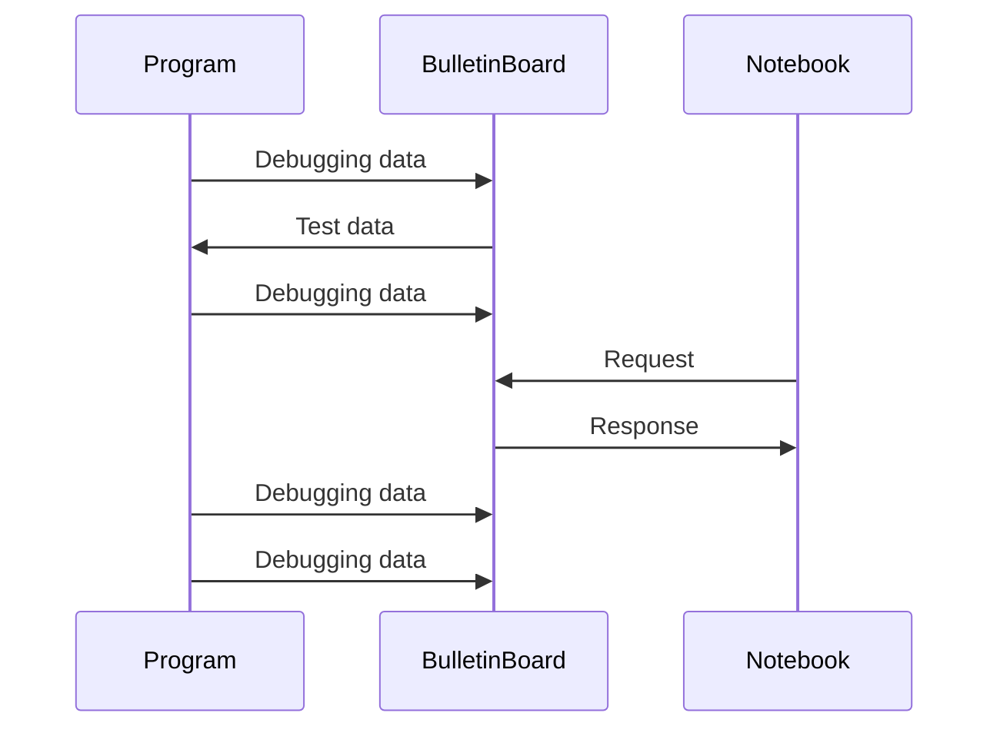

dbgbb
===========================
[](https://crates.io/crates/dbgbb)
[](https://crates.io/crates/dbgbb)
[](https://github.com/YShoji-HEP/dbgbb/blob/main/LICENSE.txt)

A framework for analyzing debugging data in a notebook.

See also [`ArrayObject`](https://github.com/YShoji-HEP/ArrayObject) and [`BulletinBoard`](https://github.com/YShoji-HEP/BulletinBoard).

Highlights
----------
* Read test data from `BulletinBoard` and send debug data to `BulletinBoard` with simple macros.
* The file name, the line number and the column number are automatically retrieved and included in the tag.
* Optional buffered sender reduces TCP transactions and maintains the program runtime speed.
* Various tools for data collection: accumuation, oneshot and frequency reduction.
* Debug data can be read during program execution and persist after execution.
* Unsigned/signed integer, real float, complex float and string are supported. For array data, `Vec`, `ndarray` and `nalgebra` are currently supported.



Example
-------
Before using `dbgbb`, you must set up a [`BulletinBoard`](https://github.com/YShoji-HEP/BulletinBoard) server and set the server address in the environmental variable. It is convenient to set it in `.cargo/config.toml` of your Rust project:
```rust
[env]
BB_ADDR = "ADDRESS:PORT"
```

The simplest example to send the data to the server:
```rust
use dbgbb::dbgbb;

fn main() {
    let test = vec![1f64, 2., 3.];
    dbgbb!(test);
}
```

At any point in the code, data may be accumulated prior to transmission. If the data is an array, the shape at each accumulation must be the same.
```rust
use dbgbb::dbgbb_acc;

fn inner(i: usize) {
    let some_calc = i * 2;
    dbgbb_acc!("label", some_calc);
}

fn main() {
    for i in 0..10 {
        inner(i);
    }
    dbgbb_acc!("label" => post);
}
```

The frequency of data acquisition can be reduced by using `oneshot` or `every` keyword. Also, the variable name can be overwritten by `.rename(...)`. To reduce the TCP transactions, put `let _buf = Buffer::on();` at the beggining of the code.
```rust
use dbgbb::*;

fn main() {
    let _buf = Buffer::on(); // The sending buffer is on until _buf is dropped.
    for i in 0..10 {
        dbgbb!(oneshot => 5, i.rename("five")); // Data is taken only at the fifth iteration.
        dbgbb!(every => 2, i.rename("zero, two, four, six, eight")); // Data is taken every two iterations.
    }
}
```
Here, `let _buf =` is necessary. Notice that `let _ =` drops the variable immediately and the buffer won't be turned on.

Data can also be read from the server.
```rust
use dbgbb::dbgbb_read;

fn main() {
    let test: Vec<f64> = dbgbb_read!("name");
    dbg!(test);
}
```

Environment Variables
---------------------
|Variable|Default|Description|
|-|-|-|
|BB_ADDR|"127.0.0.1:7578" or "/tmp/bb.sock"|Address of the bulletin board server. It is either [IP address]:[port] or [hostname]:[port]. When UNIX socket is used, the address should be the path to the uncreated socket.|
|BB_INTERVAL|"1000"|The minimal interval in msec at which the buffered sender sends data.|
|BB_TIMEOUT|"3000"|Timeout in msec that the buffered sender waits for data. (Relevant for infrequent cases)|

Crate Features
--------------
|Feature|Description|
|-|-|
|`unix`|Use the UNIX socket instead of TCP. Only available for UNIX-like OS.|
|`ndarray_15`|Enable ndarray support. The compatible version is 0.15.x.|
|`ndarray_16`|Enable ndarray support. The compatible version is 0.16.x.|
|`nalgebra`|Enable nalgebra support. Confirmed to work with version 0.33.0.|

Q&A
--------------
#### Why not use the `dbg!(...)` macro?
For a small number of variables, it is, in fact, efficient to print them using `dbg!(...)`. However, for a large number of variables like a higher-dimensional array, the output becomes cluttered and difficult to read. Together with a notebook, `dbgbb!(...)` offers an immediate visualization of variables with a similar syntax. In addition, `dbgbb` keeps all revisions in the server, so you can easily compare different versions of code.

#### Why not use a CSV file?
For arrays with more than two dimensions, CSV files are clearly not an option. In addition, for large data, the data size becomes huge compared with `dbgbb` because CSV stores values as text. Also, frequent data storage slows down the runtime speed of the program. The buffered sender of `dbgbb` allows data to be collected in an almost non-blocking manner.

#### Why not use a HDF5 file?
It is sometimes useful to be able to read debugging data while the program is running. HDF5 easily collapses if the file is opened while it is being written. In addition, the syntax of `dbgbb` is much simpler than HDF5, which requires setting the database name, array shape, etc.

#### Why not use an integrated visualizer?
When the plot is not satisfactory, the entire code must be rerun since all data is gone once the program terminates. This is often a pain in scientific computations. It is thus more sensible to separete the plotting code from the main code.
It is also important to keep the initial erroneus data because otherwise it becomes difficult to quantitatively check improvements. `dbgbb` keeps all versions, which can be read anytime.
In addition, it also makes it easier to compare with the results obtained in a different language such as Mathematica.

