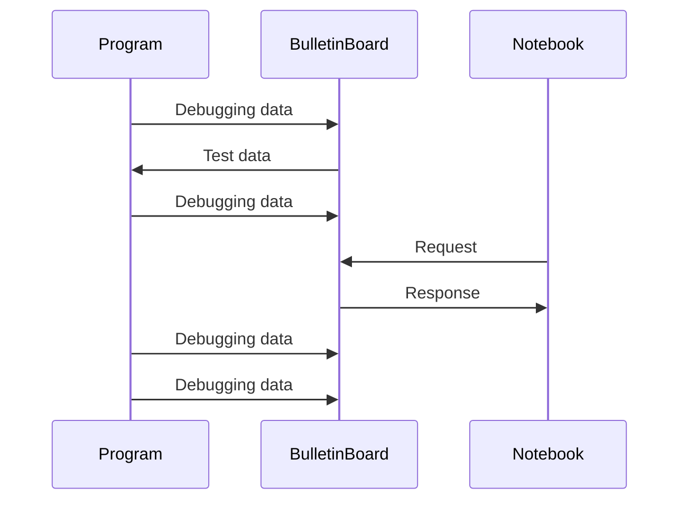

# dbgbb

[](https://www.buymeacoffee.com/YShojiHEP)
[](https://github.com/sponsors/YShoji-HEP)
[](https://crates.io/crates/dbgbb)
[](https://crates.io/crates/dbgbb)
[](https://github.com/YShoji-HEP/dbgbb/blob/main/LICENSE.txt)

**dbgbb** is a robust framework for analyzing debugging data within Mathematica and Jupyter notebooks.

Related projects: [`ArrayObject`](https://github.com/YShoji-HEP/ArrayObject), [`BulletinBoard`](https://github.com/YShoji-HEP/BulletinBoard).

## Features

- Seamless integration with [`BulletinBoard`](https://github.com/YShoji-HEP/BulletinBoard) for reading test data and sending debug data using concise macros.
- Automatic inclusion of file name, line number, and column number in debug tags.
- Buffered sender option minimizes TCP transactions, preserving program performance.
- Comprehensive data collection tools: accumulation, one-shot, and frequency reduction.
- Real-time and persistent access to debug data during and after program execution.
- In-memory server storage enables ultra-fast random access to debugging data.
- Supports unsigned/signed integers, floating-point real and complex numbers, strings, and arrays (`Vec<_>`, `[T;N]`, `ndarray`, `nalgebra`).
- High-speed communication via Unix sockets on compatible operating systems.



## Important Notes

- Data transmission is not encrypted. Do not send confidential information over the network.
- This crate is under development; APIs and specifications may change. Compatibility between `BulletinBoard` and `dbgbb` is maintained for matching minor version numbers.
- Running tests will access the server and may overwrite existing data.

## Getting Started

Before using `dbgbb`, set up a [`BulletinBoard`](https://github.com/YShoji-HEP/BulletinBoard) server and configure the server address via an environment variable. For Rust projects, one may add the following to `.cargo/config.toml`:

```toml
[env]
BB_ADDR = "ADDRESS:PORT"
```

### Basic Usage

Send data to the server with minimal code:

```rust
use dbgbb::dbgbb;

fn main() {
    let test = vec![1f64, 2., 3.];
    dbgbb!(test);
}
```

For nested arrays (`Vec<Vec<...>>`), see `dbgbb_flatten!(...)`, `dbgbb_concat!(...)`, and `dbgbb_index!(...)`.

### Accumulating Data

Accumulate data before transmission. Arrays must have consistent shapes.

```rust
use dbgbb::dbgbb_acc;

fn inner(i: usize) {
    let some_calc = i * 2;
    dbgbb_acc!("label", some_calc);
}

fn main() {
    for i in 0..10 {
        inner(i);
    }
    dbgbb_acc!("label" => post);
}
```

### Frequency Control and Buffering

Control data acquisition frequency with `oneshot` or `every`. Rename variables with `.rename(...)`. To reduce TCP transactions, enable buffering:

```rust
use dbgbb::*;

fn main() {
    let _buf = Buffer::on(); // Buffering is active until _buf is dropped.
    for i in 0..10 {
        dbgbb!(oneshot => 5, i.rename("five")); // Captures data at the fifth iteration.
        dbgbb!(every => 2, i.rename("zero, two, four, six, eight")); // Captures data every two iterations.
    }
}
```

**Note:** Use `let _buf = ...` to keep the buffer active. Using `let _ = ...` will immediately drop the buffer.

### Reading Data

Retrieve data from the server:

```rust
use dbgbb::dbgbb_read;

fn main() {
    let test: Vec<f64> = dbgbb_read!("title");
    dbg!(test);
}
```

## Environment Variables

| Variable      | Default                        | Description                                                                                                    |
|---------------|-------------------------------|----------------------------------------------------------------------------------------------------------------|
| BB_ADDR       | "127.0.0.1:7578" or "/tmp/bb.sock" | Address of the BulletinBoard server. Use `[IP address]:[port]`, `[hostname]:[port]`, or a Unix socket path.    |
| BB_INTERVAL   | "1000"                        | Minimum interval (ms) for buffered sender to transmit data.                                                    |
| BB_TIMEOUT    | "3000"                        | Timeout (ms) for buffered sender to wait for data (for infrequent cases).                                      |

## Crate Features

| Feature           | Description                                                                                  |
|-------------------|---------------------------------------------------------------------------------------------|
| `unix`            | Enables Unix socket support (Unix-like OS only).                                             |
| `no_compression`  | Disables compression for improved performance with random floating-point data.                |
| `ndarray_15`      | Enables support for `ndarray` version 0.15.x.                                                |
| `ndarray_16`      | Enables support for `ndarray` version 0.16.x.                                                |
| `nalgebra`        | Enables support for `nalgebra` (tested with version 0.33.0).                                 |
